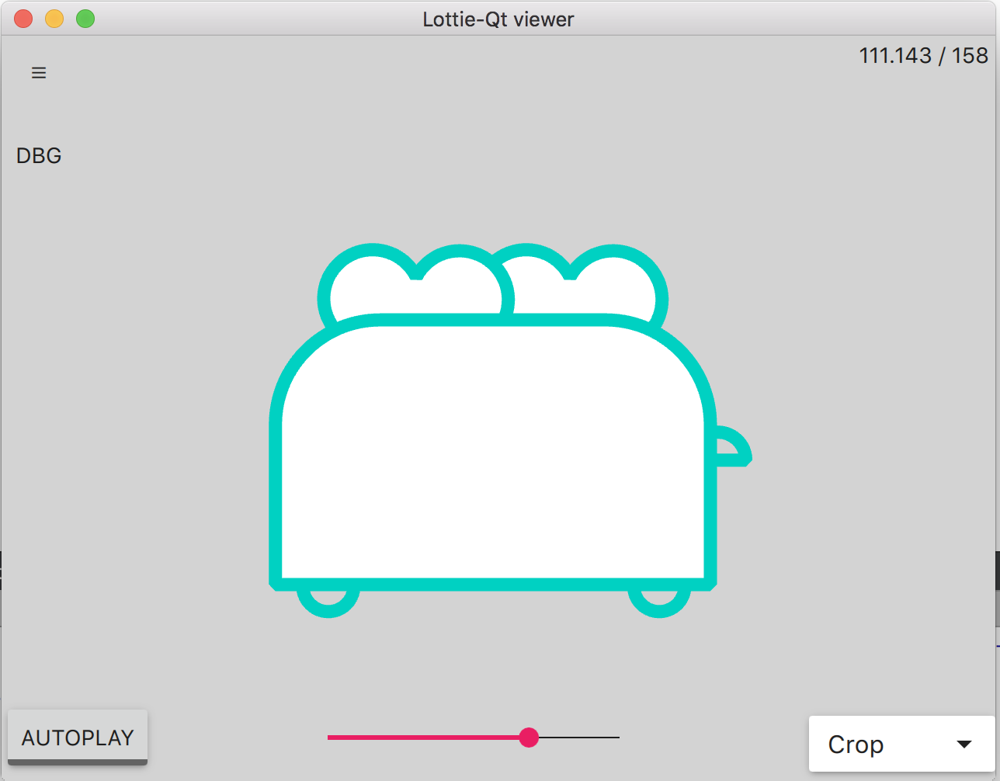

# Lottie QtQuick 

This is Lottie for Qt. It was not invented by us and most of the code was directly ported from the iOS Objective-C code.

This version has known bugs and does not work (especially masks are missing). Expect asserts, unfinished parts of the code might have them commented out.

Tested with Qt 5.10.1 on Android/iOS/macOS. Built once with 5.12.0 :)

## Examples

Viewer: 

Typewriter: 
